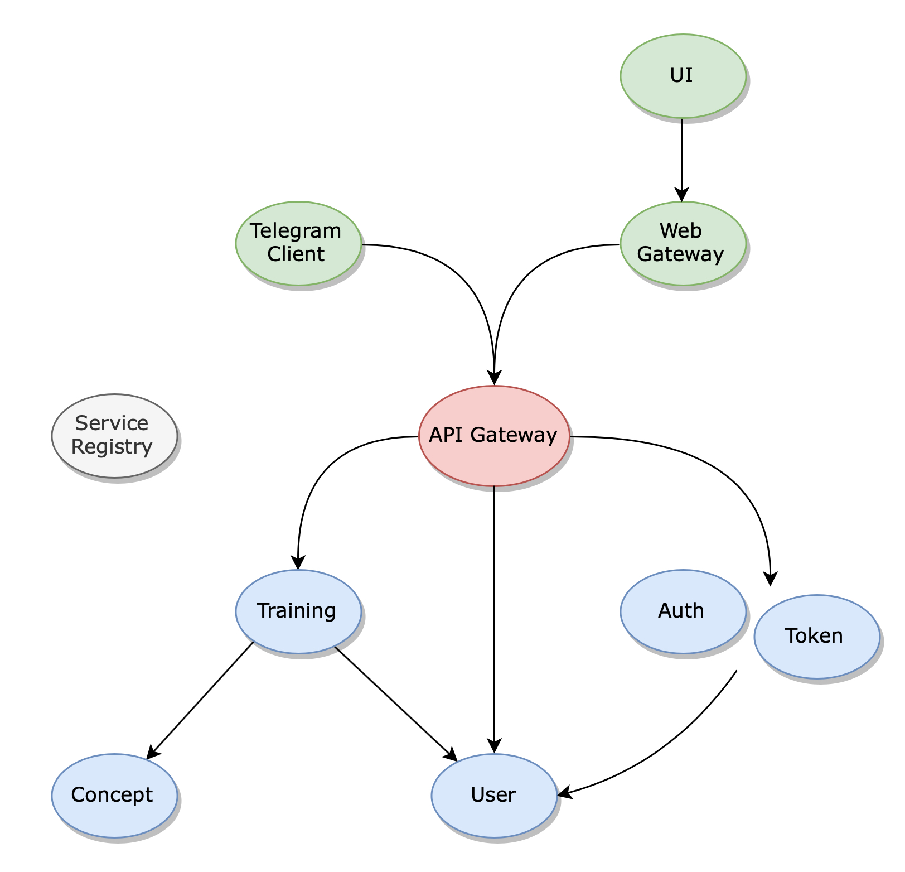

# Ovcharka

Ovcharka is a smart exam assistant intended for self-training in theoretical aspects of various subject areas.
Given a list of related keywords it asks about some of them with clarifying questions additionally.

The project consists of Spring-based RESTful services interacting with each other via HTTP.

There is a **Service Registry** marked in grey that finds available instances of a service and tells other services where they are located.

Services marked in blue execute all the key tasks: perform algorithms on received data, store it and retrieve the requested information.

**Concept service** is responsible for the information about all the concepts currently supported.

**User service** stores all the information about any registered user of the application.

**Training service** stores the current state of a particular training of a particular user.
It also performs user answer checking, choosing the next question and calculating the result.

**Auth service** is responsible for registering a new person and retrieving an authentication token for the logged in user.

**Token service** is used to create a token for authentication in external applications.

**API Gateway** marked in red is an entry point to the application and a proxy to the downstream services.

There are also some client services marked in green specific to the particular kind of connection.

There is **Web Gateway** that proxies the requests with the user details to the API Gateway.
It checks the user rights for the specific request and redirects it down flow.

**Telegram Client** is a Telegram bot that makes sure that user has authenticated and proxies his requests in a downstream direction.

The common formats of requests and algorithms used are discussed in the [report](docs/report.pdf).
